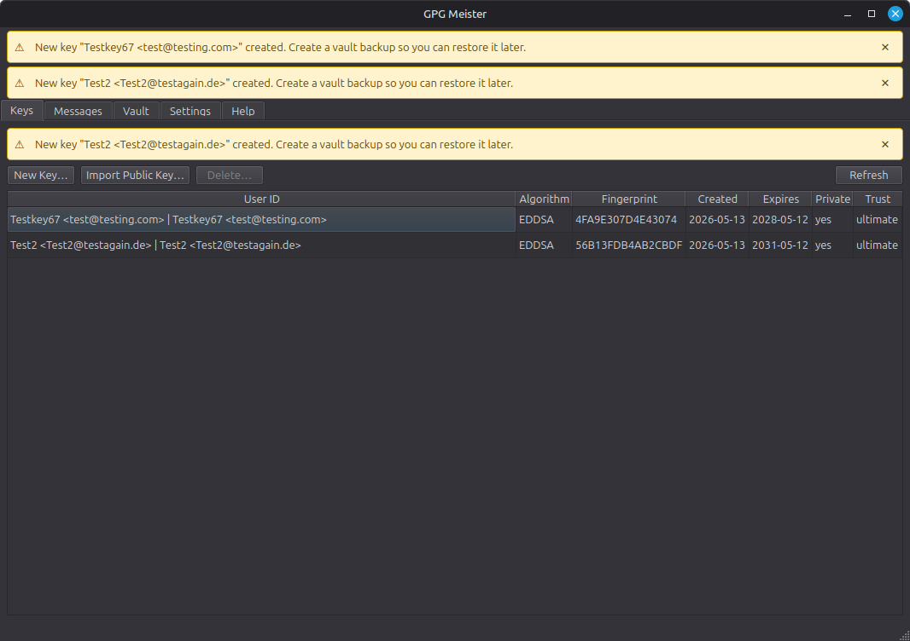
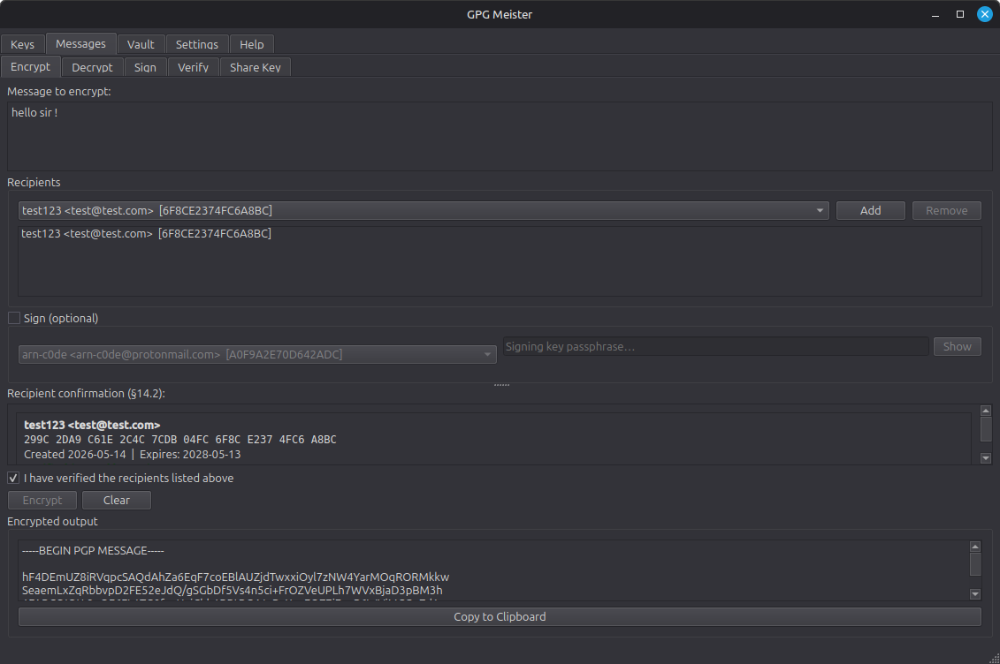
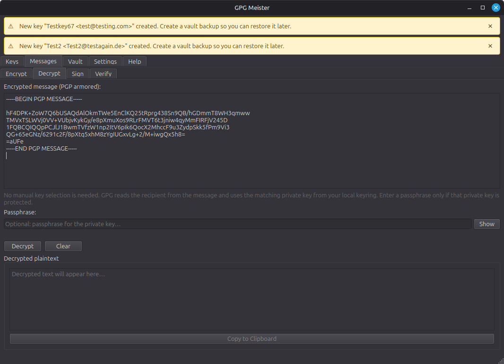
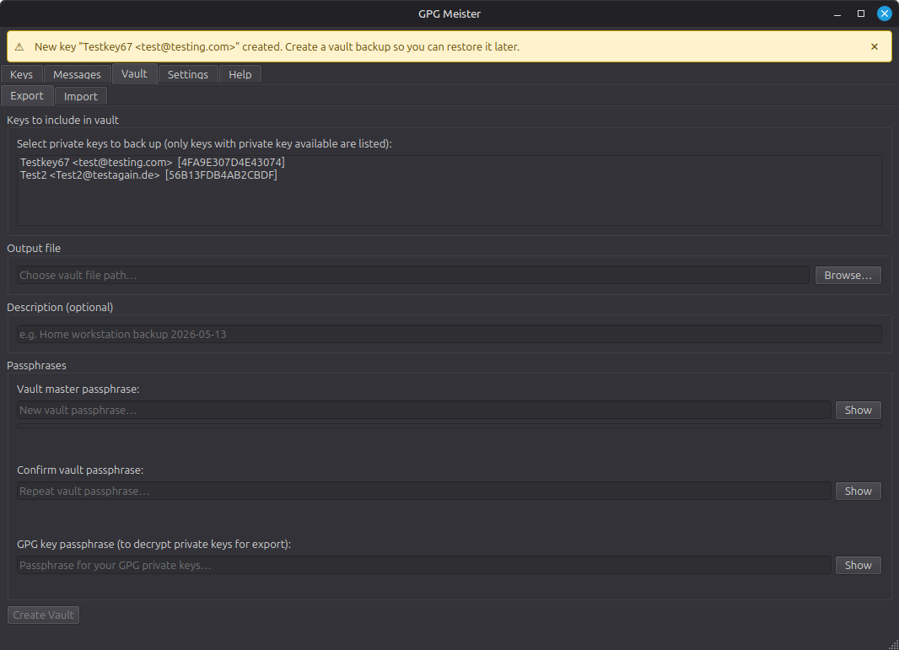
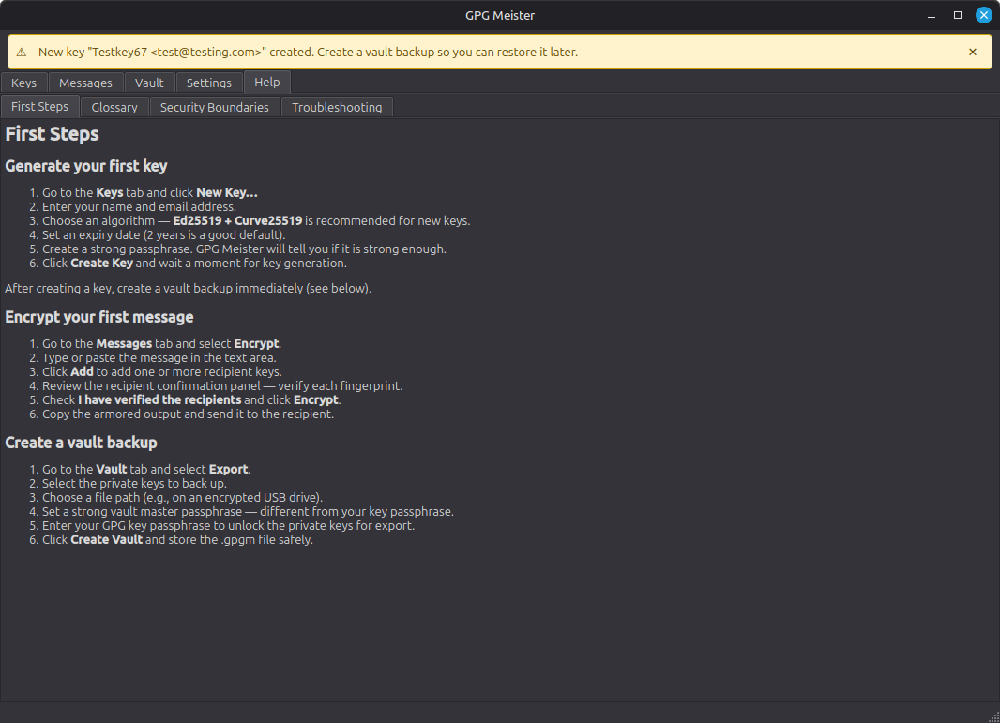

# GPG Meister

<p align="center">
  
</p>

[](CHANGELOG.md)
[](#tech)
[](#tech)
[](#security)
[](#tech)
[](CHANGELOG.md)
[](https://deepwiki.com/arn-c0de/GPG-Meister)

Desktop app for managing GPG keys, encrypted messages, signatures, and encrypted key backups.

GPG Meister is a local-first desktop application built on GnuPG. It gives users a focused interface for creating and importing keys, encrypting and signing messages, verifying signatures, and exporting encrypted vault backups of key material.

## Current Status

> [!WARNING]
> GPG Meister is in active development.
>
> **Important:** The app is functional, but internal structures and the vault format may still change between releases. Keep independent backups of your GPG keys before updating. UI details, workflows, and compatibility guarantees are still evolving.

## Features
- **Key management**: Create, import, inspect, label, and manage GPG keys.
  
- **Message operations**: Encrypt, decrypt, sign, and verify text messages.
  
  
- **Encrypted vault backups**: Export and import encrypted key vaults for backup or transfer.
  
- **Smartcard / YubiKey support**: Use keys held on a YubiKey, Nitrokey, or other OpenPGP card to decrypt and sign with the card PIN instead of a passphrase, see at a glance which device holds each key, and optionally add a token as a second way to unlock a vault.
- **Built-in help**: Use the integrated help pages and glossary for common GPG concepts.
  
- **Local-first workflow**: Keep cryptographic operations and metadata on your own machine.
- **Internationalized UI**: Use the app in English or German.

## Downloads
Prebuilt releases for Linux, Windows, and macOS are available here:

[GitHub Releases](https://github.com/arn-c0de/GPG-Meister/releases)

For version history and release notes, see the [Changelog](CHANGELOG.md).

## Contributing

Language contributors are currently wanted. GPG Meister ships with English and German today, and additional UI languages are tracked in [issue #1](https://github.com/arn-c0de/GPG-Meister/issues/1).

See [CONTRIBUTING.md](CONTRIBUTING.md) for translation guidelines, development notes, and the contributor Hall of Fame.

## Getting Started
### Requirements
- GnuPG 2.2+
- Python 3.11+
- `uv` for the recommended development workflow

## Docs
- [Changelog](CHANGELOG.md)
- [Documentation Overview](docs/overview.md)
- [Plan vs Code](docs/plan-vs-code.md)
- [App and Startup Flow](docs/app-startup.md)
- [Service Layer](docs/services.md)
- [Security Policy](SECURITY.md)
- [Code of Conduct](CODE_OF_CONDUCT.md)
- [Storage Layer](docs/storage.md)
- [UI Layer](docs/ui.md)

## Security
- Local-first design with no cloud dependency
- Encrypted vaults for key backup and transfer
- Dedicated audit logging for security-relevant events
- GnuPG binary detection with trust pinning
- Local metadata store that does not keep private keys or passphrases
- Security reporting policy: [SECURITY.md](SECURITY.md)

## Tech
- Python 3.11+
- PySide6 / Qt 6
- GnuPG
- `python-gnupg`
- Pydantic v2

## Development
```bash
git clone https://github.com/arn-c0de/GPG-Meister.git
cd GPG-Meister
uv sync --extra dev
uv run gpgmeister
```

### Run `gpgmeister` from anywhere

`install.sh` links `gpgmeister` into `~/.local/bin` automatically, so after
installation the command is available system-wide:

```bash
gpgmeister
```

Make sure `~/.local/bin` is in your `PATH` (it usually is by default on Linux).
If not, add it once:

```bash
echo 'export PATH="$HOME/.local/bin:$PATH"' >> ~/.bashrc && source ~/.bashrc
```

### Checks
```bash
uv run pytest
uv run ruff check .
uv run mypy
```

## Packaging
```bash
python scripts/build_translations.py
./scripts/build_appimage.sh
./scripts/generate_sbom.sh dist
```

## Contact
- GitHub Issues: [arn-c0de/GPG-Meister/issues](https://github.com/arn-c0de/GPG-Meister/issues)
- GitHub Contact Page: [arn-c0de contact](https://github.com/arn-c0de)
- Email: [arn-c0de@protonmail.com](mailto:arn-c0de@protonmail.com)

For bugs, unexpected behavior, or rough edges, open an issue or use one of the contact paths above.

## License
MIT. See the `LICENSE` file.
