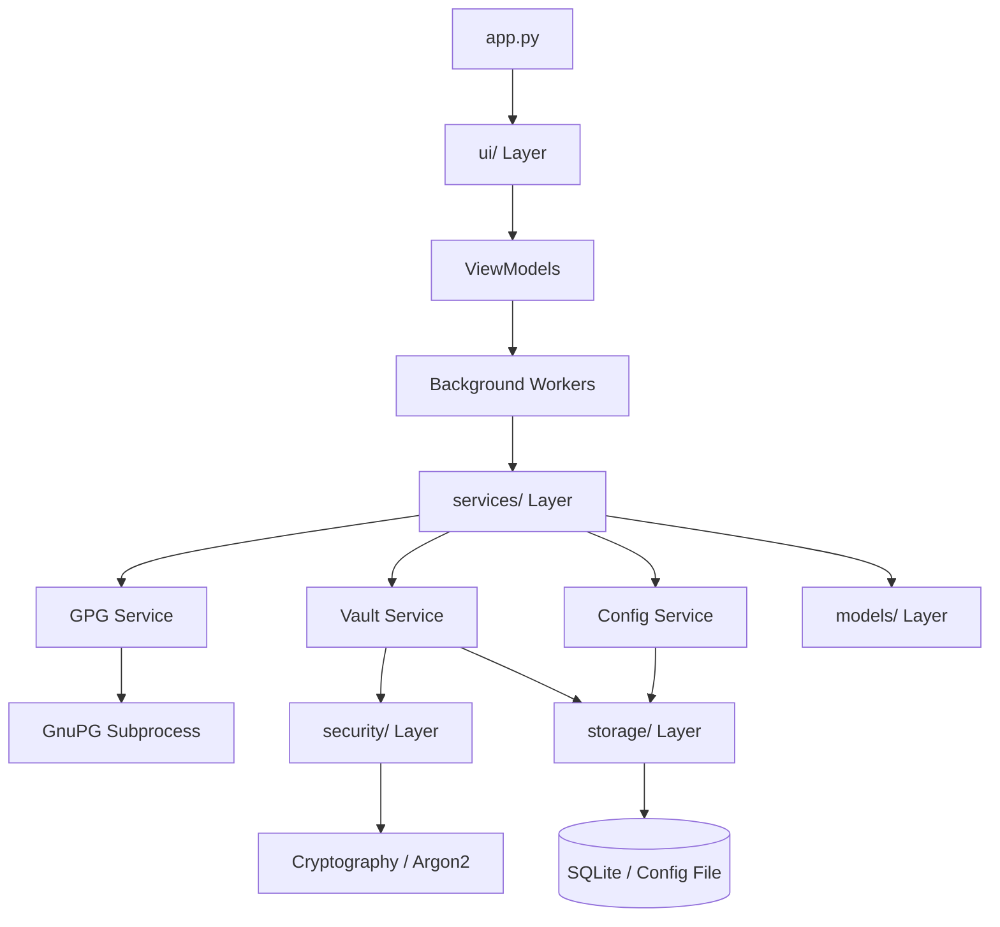

# GPG Meister Documentation

This folder documents the current implementation of GPG Meister.

The documentation reflects the code in `src/gpg_meister`. For historical context, `planv2.md` remains useful, but the source code and these documents are the implementation reference.

## Architecture Overview

## Start Here

- [App and Startup Flow](app-startup.md) explains how the app boots, resolves GPG, and wires services and UI.
- [Domain Models](models.md) explains the main Pydantic models and what data they hold.
- [Security Modules](security.md) explains key derivation, authenticated encryption, secure memory, and the vault frame.
- [Service Layer](services.md) explains the business layer around GPG, messages, keys, config, and vaults.
- [Storage Layer](storage.md) explains local files, SQLite metadata, atomic writes, locks, logs, and permissions.
- [UI Layer](ui.md) explains the MVVM-style UI structure and background workers.
- [Startup Checks and GPG Detection](startup.md) explains startup checks and GPG binary trust detection.
- [Plan vs Current Code](plan-vs-code.md) compares `planv2.md` with the current implementation.

## Architecture Map

The app is organized into focused layers:

- `models/` holds validated domain objects.
- `security/` holds crypto and sensitive-memory helpers.
- `services/` holds application logic and GPG orchestration.
- `storage/` holds local persistence and safe file handling.
- `startup/` checks the machine before the app continues.
- `ui/` holds Qt views, viewmodels, widgets, and workers.
- `app.py` wires the runtime dependencies.

## Security Boundary

Private keys and passphrases are never stored in the SQLite metadata database or in the config file. They only flow through the GPG service, the vault flow, and short-lived in-memory buffers.

---
[← Back to README](../README.md)
